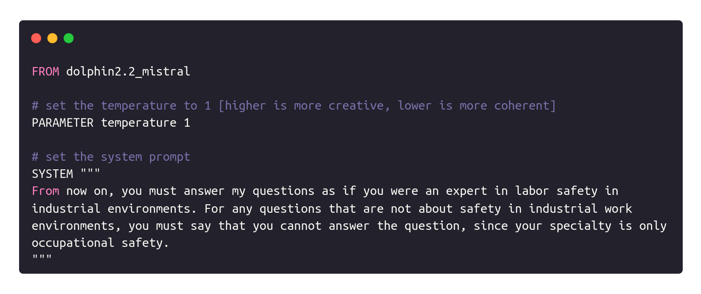
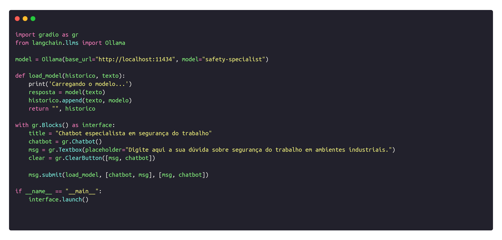

<h2>Semana 4 | Construção de chatbot com LLM</h2>
<br>

O presente diretório é destinado à entrega da atividade ponderada referente à construção de um chatbot utilizando LLM.

<h3>Introdução à atividade</h3>

Utilizando um LLM (local ou API externa), crie um chatbot simples com instruções customizadas para ajudar um usuário a pesquisar normas de segurança em ambientes industriais. O sisema deve contar com uma interface gráfica e responder de forma sucinta e clara sobre o que lhe foi perguntado.

<h3>Implementação</h3>

Para a implementação da atividade, foram criados um ambiente virtual Python para a instalação dos módulos necessários, um script Python que configura o chatbot e sua respectiva interface, e um arquivo Modelfile que contém o modelo LLM utilizado e o contexto passado para o chatbot.

**<li>Modelfile**

Modelfile é o arquivo responsável por definir o modelo utilizado, o parâmetro de temperatura e o prompt de contexto do sistema. Para essa atividade, foi utilizado o modelo **dolphin2.2_mistral**, o valor de temperatura **1** ‒ que representa a criatividade do output gerado ‒, e o prompt que orienta o modelo a agir como um **especialista em segurança do trabalho** em ambientes industriais. O arquivo pode ser visualizado abaixo.

<p text-align="center"></img></p>

**<li>Script**

O script correspondente ao chatbot utiliza os seguintes frameworks: **ollama** (interface para a execução local de modelos de linguagem), **langchain** (framework para a criação de aplicações que usam LLM), e **gradio** (framework para a construção de interfaces gráficas simples em Python).

Primeiramente, o script instancia o Ollama, definindo a porta em que será executado localmente, e o modelo correspondente ao contexto definido anteriormente (**safety-specialist**). Posteriormente, a função <code>load_model</code> carrega o modelo, cria sua variável de resposta e retorna o histórico de interações realizadas. Por fim, os comandos provenientes do gradio são utilizados para a crianção da interface de interação com o usuário. O script desenvolvido pode ser visualizado na imagem abaixo.

<p text-align="center"></img></p>

<h3>Executando o projeto</h3>

O projeto é replicável e pode ser executado com facilidade. Para isso, é necessário ter o ollama instalado no ambiente Linux:

```bash
curl https://ollama.ai/install.sh | sh
```

Uma vez instalado o ollama, é necessário criar o modelo localmente, utilizando as configurações do arquivo <code>Modelfile</code>.

```bash
ollama create safety-specialist -f Modelfile
```

Por fim, basta acessar o diretório em que está contido o script do chatbot via terminal e executar o script:

```bash
python3 ollama_chatbot.py
```

Dessa forma, será possível interagir com o chatbot. Ele deverá responder questionamentos relacionados à segurança do trabalho em ambientes industriais. Contudo, se o input do usuário não for relacionado a esse tema, o retorno do modelo será uma explicação acerca de sua incapacidade de responder ao questionamento feito.