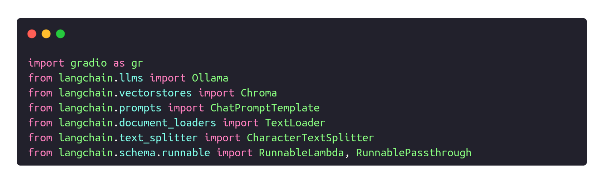
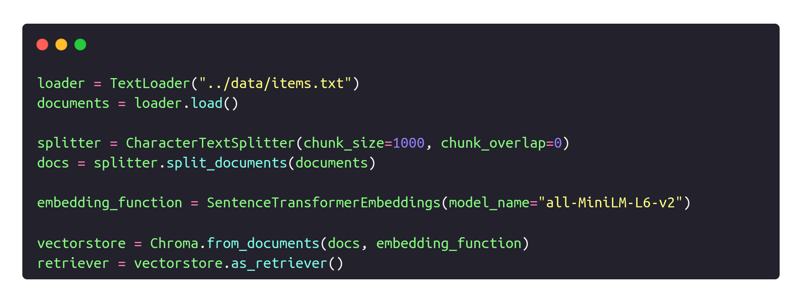
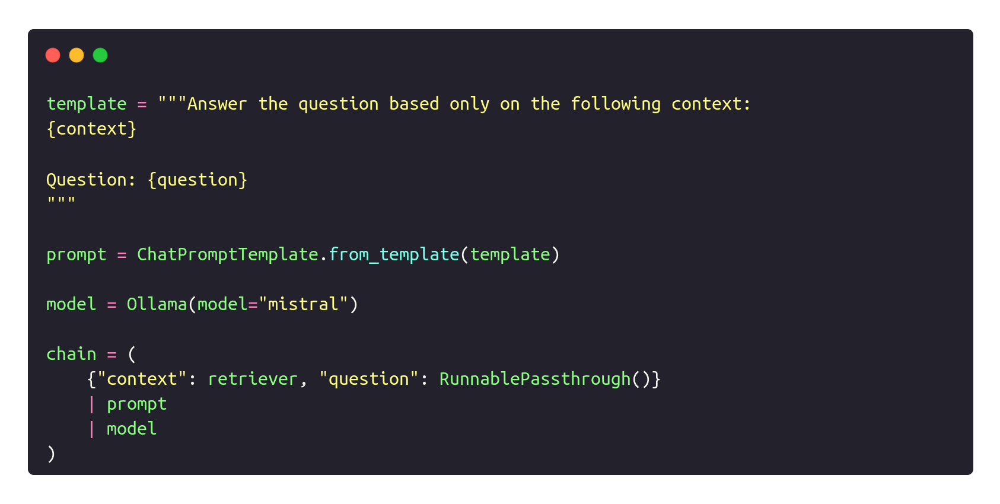
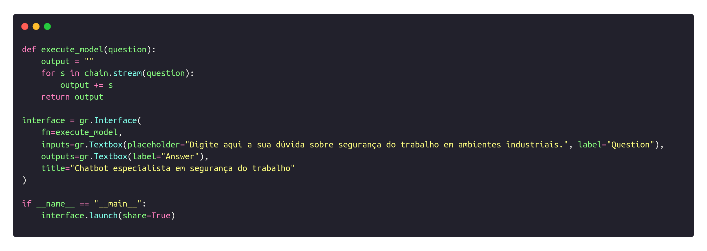
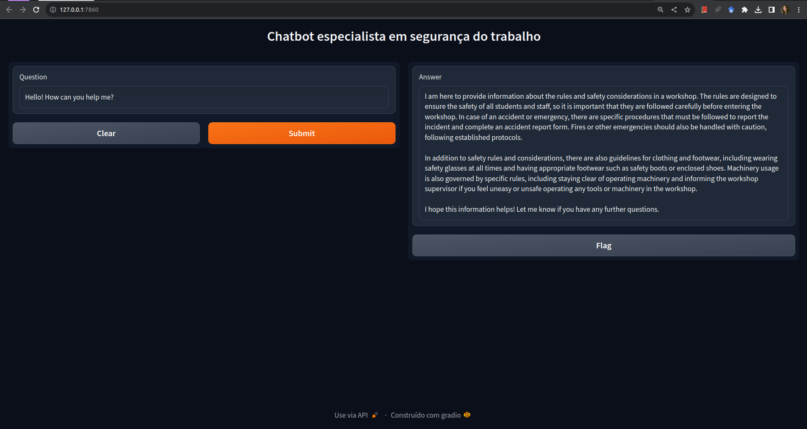
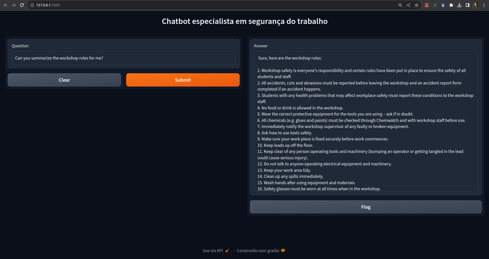

<h2>Semana 6 | Construção de um chatbot com LLM e RAG</h2>
<br>

O presente diretório é destinado à entrega da atividade ponderada referente à criação de um chatbot que utiliza um Large Language Model (LLM) em conjunto com a técnica Retrieval-Augmented Generation (RAG). A atividade configura uma evolução da atividade ponderada 4.

<h3>Introdução à atividade</h3>

Utilizando um LLM (local ou API externa), crie um chatbot simples com instruções customizadas para ajudar um usuário a pesquisar normas de segurança em ambientes industriais. O sisema deve contar com uma interface gráfica e responder de forma sucinta e clara sobre o que lhe foi perguntado. O sistema ainda deve ser capaz de contextualizar suas respostas a partir do seguinte documento: [Workshop rules and safety considerations](https://www.deakin.edu.au/students/study-support/faculties/sebe/abe/workshop/rules-safety).

<h3>Implementação</h3>

Para a implementação da atividade, optei por utilizar o modelo <code>mistral</code> do Ollama como opção de Large Language Model. Além disso, o framework <code>gradio</code> foi escolhido para a criação de uma interface simples para interação com o chatbot. Para atender ao principal requisito da atividade ‒ treinar o modelo com base em um documento ‒, o conteúdo do link fornecido foi extraído e passado para um arquivo de texto, o qual foi utilizado no script do chatbot.

O script do chatbot pode ser visualizado no arquivo <code>chatbot.py</code>. Para a construção do script, a lógica implementada foi a seguinte:

Primeiramente, são importados os frameworks utilizados na atividade (<code>langchain</code> e </code>gradio</code>), assim como os módulos do Langchain necessários para o funcionamento do código. 

<p align="center"></img></p>

Em seguida, o arquivo de texto é lido e são realizados alguns procedimentos para a implementação do RAG: divisão do texto em chunks e a vetorização do conteúdo do documento, posteriormente utilizado para retrieval.

<p align="center"></img></p>

Posteriormente, foi criado um template para o prompt passado para o modelo. O modelo foi instanciado e, abaixo, foi criada uma cadeia de execução que leva em consideração a técnica de retrieval, o prompt e o modelo.

<p align="center"></img></p>

Por último, foi criada a função <code>execute_model</code>, responsável pela execução do LLM a fim de gerar um output para o usuário. Essa função é chamada no bloco de código seguinte, o qual se caracteriza pela construção da interface gráfica. A interface é composta por um campo de texto para a entrada do usuário e um campo de texto para a saída do chatbot. A função <code>execute_model</code> é chamada quando o usuário pressiona o botão <code>Submit</code>. Por fim, a interface é executada.

<p align="center"></img></p>

<h3>Execução</h3>

Para executar o projeto localmente, basta realizar o download do diretório em que se encontram o script do chatbot e o arquivo de texto. Em seguida, é necessário instalar os frameworks utilizados:

```
pip install -r requirements.txt
```


Posteriormente, será necessário executar o modelo Ollama utilizado:

```
ollama run mistral
```

Por fim, o script do chatbot pode ser executado:

```
python3 chatbot.py
```

<h3>Demonstração</h3>

Abaixo, é possível visualizar imagens demonstrativas do chatbot em funcionamento:

<p align="center"></img></p>

Na imagem acima, perguntei o que o chatbot poderia fazer por mim. Baseando-se no contexto utilizado para treiná-lo, ele responde que pode me informar sobre regras e considerações de segurança em um workshop.

<p align="center"></img></p>

Na imagem acima, perguntei ao chatbot se ele poderia me informar sobre regras de segurança no workshop em questão. Ele respondeu que sim e listou as dezesseis regras de segurança presentes no documento utilizado para treiná-lo.

**Observação:** o vídeo de demonstração ainda não foi gravado, uma vez que o modelo Ollama escolhido demora consideravelmente para ser executado.