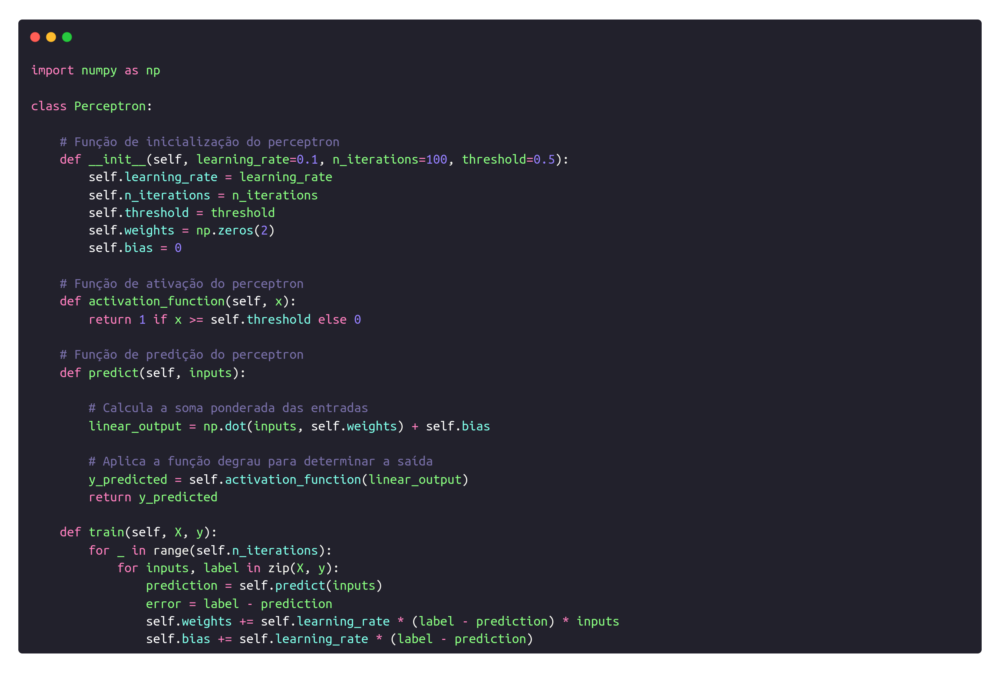
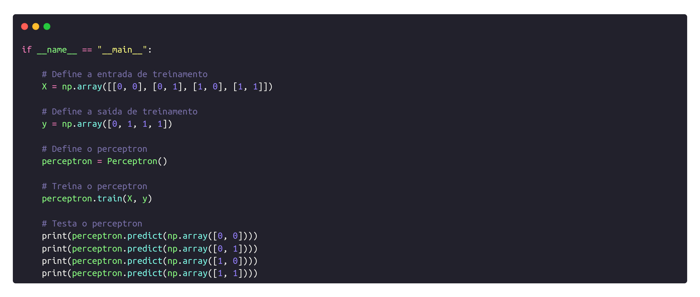
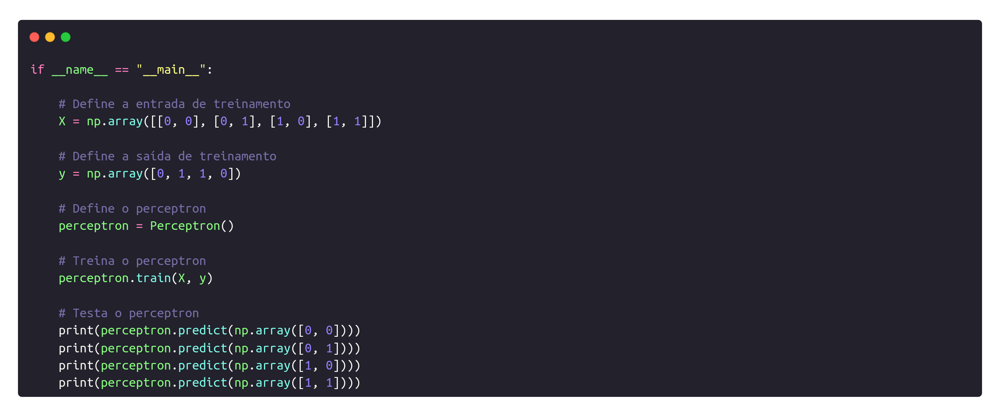

<h2>Semana 6 | Implementação de um Perceptron</h2>
<br>

O presente diretório é destinado à entrega da atividade ponderada referente à criação de um perceptron para portas lógicas.

<h3>Introdução à atividade</h3>

Atividade em sala de aula para implementar um perceptron capaz de ser treinado para reproduzir o comportamento das seguintes portas lógicas: AND, OR, NAND e XOR.

<h3>Implementação</h3>

A implementação do perceptron foi feita por meio de um script Python. Primeiramente, foi criada a classe <code>Perceptron</code>, que é instanciada quando queremos ativar um perceptron para uma porta lógica espefícica. A classe conta com os seguintes métodos:

**<code>__ init __</code>** inicializa os atributos do perceptron: learning rate, número de iterações, limiar, pesos e bias.

**<code>activation_function</code>** função de ativação do perceptron, que retorna 1 se o valor de entrada for maior que o limiar e 0 caso contrário.

**<code>predict</code>** função que recebe os valores de entrada, faz a soma ponderada dos valores e retorna a saída do perceptron ao aplicar a função degrau.

**<code>train</code>** função responsável por treinar o perceptron para um dado input. O bloco de código começa com o loop relativo à quantidade de iterações definidas na primeira função. Posteriormente, para cada input é submetido ao processo de predição e o erro é calculado. De acordo com o erro identificado, os pesos e o bias são atualizados.

Na iamgem abaixo, é possível visualizar a estrutura do código:

<p align="center"></img></p>

A segunda parte do código, por outro lado, dedica-se à criação do input e do output informados para o treinamento do perceptron. Dessa forma, a classe <code>Perceptron()</code> é instanciada e submetida ao treinamento através do método <code>train()</code>. Por fim, os resultados dos testes de predição são exibidos no terminal.

Abaixo, é possível visualizar o bloco de código explicado acima para cada uma das portas lógicas:

<p align="center">1. Porta lógica <b>AND</b></p>
<p align="center"></img></p>

<p align="center">2. Porta lógica <b>OR</b></p>
<p align="center"></img></p>

<p align="center">3. Porta lógica <b>NAND</b></p>
<p align="center"></img></p>


<p align="center">4. Porta lógica <b>XOR</b></p>
<p align="center"></img></p>

**O problema da porta lógica XOR**

A porta lógica XOR configura um caso especial quando se trata de implementação de perceptrons. Isso ocorre porque a porta XOR não é linearmente separável. Dessa forma, o perceptron não consegue aprender a função de ativação da porta XOR. O problema poderia ser resolvido por meio da implementação de um **multi-layer perceptron**, que adiciona uma camada intermediária entre a camada de entrada e a camada de saída do perceptron.

<h3>Execução</h3>

Para executar cada perceptron, basta escolher abrir o diretório da atividade no terminal. Posteriormente, o script referente à cada porta lógica pode ser executado da seguinte maneira:

```bash
python3 <logic_gate>_perceptron.py
```

<h3>Demonstração</h3>

O vídeo demonstrativo abaixo expõe o resultado da execução dos scripts, comprovando que os perceptrons foram treinados corretamente para cada porta lógica, com exceção da porta XOR.

___[vídeo demonstrativo]___